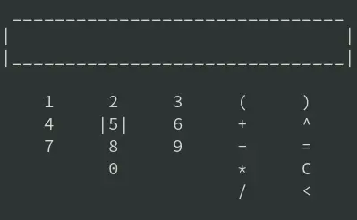

<p align="center">
    
</p>

# simple console gui calculator 

- math expression evaluator engine: https://github.com/vatbub/mathevaluator  
- keyboard listener: https://github.com/kwhat/jnativehook  

### build
```shell
./gradlew jar
```
### run
```shell
cd build/libs
java -jar kotlin-cli-calculator-0.1.jar
```